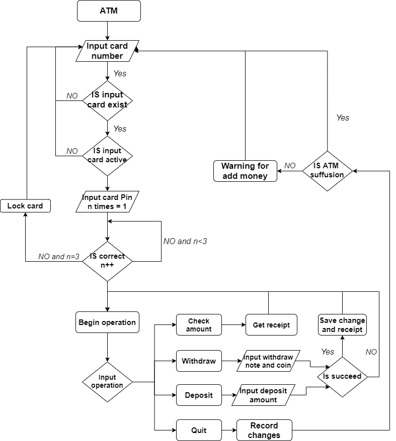

ATM
===
---
***Our project is an ATM software application that allows users to carry out a number of account management operations.***
 
---
**Usage instructions:**
1. Use `gradle run --console=plain` to start the main function
2. Enter a valid bank card number
3. The system will return the status of the card
4. If the card is active, you will be asked to enter the card pin, which allows 3 attempts
5. If invalid pins were entered 3 times, the card will be locked
6. If the pin is valid, you will be given 4 options (you can type `c`/`cancel` to cancel the first 3 operations):
   1. **Deposit**: Type `d`/`deposit` to activate
      1. Input a valid deposit amount (greater than 0, notes only, invalid input will return you to the previous menu)
      2. A receipt will be printed after a valid operation
      3. You will be returned to the previous menu
   2. **Withdraw**: Type `w`/`withdraw` to activate
      1. Input a valid withdrawal amount (greater than 0, less than the balance and less than the notes/coin in ATM, 
      invalid input will return you to the previous menu)
      2. A receipt will be printed after a valid operation
      3. You will be returned to the previous menu
   3. **Check card balance**: Type `b`/`checkbalance` to activate
      1. A message with remaining amount will be printed directly
   4. **Quit**: Type `q`/`quit` to return to the previous menu
7. If all operations are completed, use `control`+`c` and type `Y` to exit the system
### The following flow chart is to show the operating procedure of the entire program:
 

